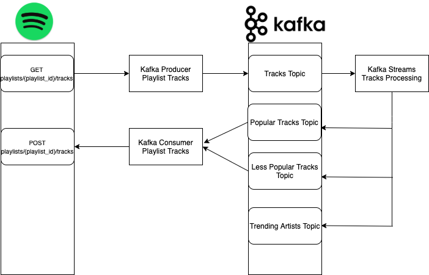

# Spotify Playlist Generator

Generate personalized playlists containing the most popular songs from across your favorite public Spotify playlists

## How it works

1. A Kafka Producer fetches songs from the Spotify playlists mentioned in the `config.json` (tracks_producer/config/config.json) and produces to the tracks topic

2. A KafkaStreams app processes the tracks and produces to 3 topics: 
 - Popular-Tracks Topic: All songs with a track popularity >= 80%
 - Less-Popular-Tracks Topic: All songs with a track popularity < 80%
 - Trending-Artists Topic: List of artists who appeared more than twice across playlists

3. A Kafka Consumer consumes from the popular and less-popular topics and makes a REST call to Spotify and creates 2 new playlists containing these new tracks. 

## Usage

Prereqs: Zookeeper and Kafka Server running locally

Clone and run the following commands from the root of the repo: 

- Track Producing: `go run tracks-producer/tracks_producer.go`
- Track Consuming: `go run tracks-consumer/tracks_consumer.go`
- Track Processing: `TODO: Add tracks-processing jar file` (For now you can run it in an IDE)
